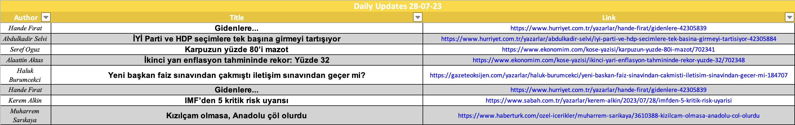
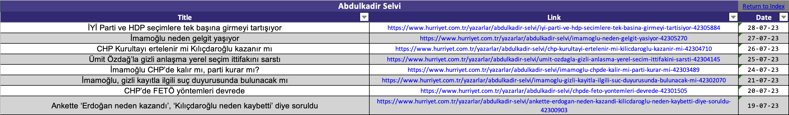

# Automated News Collector - Readme





This is a Python project designed to aggregate financial and economic news articles from various Turkish sources, with a focus on Finance. The project utilizes web scraping techniques to fetch and process articles and leverages Excel files for efficient data storage and daily updates.

## Table of Contents
- [Summary]()
- [Project Aim](#project-aim)
- [Workflow Overview](#workflow-overview)
- [Key Functions](#key-functions)
- [Installation](#installation)
- [Usage](#usage)
- [Scheduling the Script](#scheduling-the-script)
- [Error Handling](#error-handling)
- [Contributing](#contributing)
- [License](#license)
- [About News Collector](#about-newscollector)
- [Features](#features)
- [Getting Started](#getting-started)
- [Configuration](#configuration)
- [Troubleshooting](#troubleshooting)
- [Known Issues](#known-issues)
- [Authors](#authors)
- [Acknowledgments](#acknowledgments)

## Summary

The provided Python script is part of a news aggregation and data tracking project that aims to fetch, process, and save financial and economic news articles from various Turkish sources. The project utilizes web scraping techniques to extract article information, and it leverages Excel files for data storage and daily updates.

## Project Aim

The main goal of the project is to aggregate financial and economic news articles from multiple Turkish sources, particularly focusing on the user's interest in finance and technology. The project tracks daily updates and ensures that new articles are saved while avoiding duplicates.

## Workflow Overview

The project consists of several components and functionalities that work together to achieve its objectives. Here's an overview of the workflow:

### a. Web Scraping and Fetching News

- The script utilizes libraries like `requests` and `BeautifulSoup` to scrape and parse the HTML content of various news websites.
- Specific parser functions are defined for each news source, extracting relevant information like article titles, links, and publication dates.

### b. Excel Data Management

- The project uses Excel files for data storage and tracking. The main Excel file, `Up_To_Date_NEWS_FILE`, stores historical news articles from various sources.
- Each source is tracked separately in the Excel file, and past articles are saved in a dictionary for quick access.
- A separate sheet, labeled 'Daily-Updates-[DATE]', is used to store new articles published on each day.

### c. Daily Updates

- The script runs hourly and checks if a new day has started.
- If it's a new day, the 'Daily-Updates' sheet is reset to prepare for the new day's articles.

### d. Fetching and Processing Articles

- For each news source, the script fetches current articles and processes them to identify new articles not previously recorded.
- New articles are saved to the Excel file and marked as processed to avoid duplicates.

## Key Functions

- `process_articles`: Fetches and processes new articles for a given news source, identifying new articles and saving them.
- `reset_daily_updates_sheet`: Resets the 'Daily-Updates' sheet in the Excel file when a new day starts.
- `is_new_day`: Checks if the current date is a new day to trigger the 'Daily-Updates' sheet reset.

## Installation

This project requires Python 3.8 or higher. Follow the steps below to set up the project:

1. Clone the repository:
   ```bash
   git clone https://github.com/MertMAltinsoy/Automated-News-Collector
   ```
2. Navigate to the project directory:
   ```bash
   cd Automated-News-Collector
   ```
3. Install the required packages:
   ```bash
   pip install -r requirements.txt
   ```

## Usage

To run the project, navigate to the `src` directory and run `main.py`:
```bash
python main.py
```
This will start the script, which will fetch and process articles from the configured news sources.

## Scheduling the Script

To keep the news articles up-to-date, you should schedule the script to run periodically. Below are instructions for Unix-based systems (like MacOS and Linux) and Windows.

### On Unix-based systems (like MacOS and Linux)

You can use `cron` to schedule the script. Open your crontab file with the command:
```bash
crontab -e
```

Then, add the following line to schedule the script to run every hour:
```bash
0 * * * * /usr/bin/python3 /path/to/your/script/main.py
```
Don't forget to replace `/path/to/your/script/main.py` with the actual path to your `main.py` file.

### On Windows

You can use Task Scheduler to schedule the script:

1. Open Task Scheduler.
2. Click on "Create Basic Task...".
3. Name the task and click "Next".
4. Choose "Daily" and click "Next".
5. Set the start time and select "Recur every: 1 hour", then click "Next".
6. Choose "Start a program" and click "Next".
7. Browse to your Python executable file (usually located in `C:\PythonXX\python.exe` where `XX` is the version) in the "Program/script" field.
8. In the "Add arguments" field, put the path to your `main.py` script.
9. Click "Next" and then "Finish".

## Error Handling

The script includes exception handling to manage unexpected errors that might occur during web scraping or data processing. Proper logging is used to track progress and identify issues, ensuring smooth and reliable execution.

## Contributing

Pull requests are welcome. For major changes, please open an issue first to discuss what you would like to change.

## License

This project is licensed under the [MIT License](https://choosealicense.com/licenses/mit/).

## About NewsCollector

NewsCollector is a comprehensive news aggregation tool designed to fetch, process, and store financial and economic news articles from various Turkish sources. The project aims to provide a reliable and efficient way for users to stay updated with the latest news in finance and technology. By leveraging web scraping techniques and Excel for data storage, NewsCollector ensures that users have access to the most recent articles while avoiding duplicates.

## Features

- Web Scraping: NewsCollector uses libraries like requests and BeautifulSoup to scrape and parse the HTML content of various news websites.
- Excel Data Management: The project uses Excel files for data storage and tracking. Each news source is tracked separately, and past articles are saved for quick access.
- Daily Updates: The script runs hourly and checks if a new day has started. If it's a new day, the 'Daily-Updates' sheet is reset to prepare for the new day's articles.
- Fetching and Processing Articles: For each news source, the script fetches current articles and processes them to identify new articles not previously recorded.

## Getting Started

To get started with NewsCollector, you'll need to have Python 3.8 or higher installed on your system. Once you've cloned the repository and installed the required packages, you can run the main.py  script to start fetching and processing articles. If you encounter any issues during setup, refer to the Troubleshooting section or reach out for support.

## Configuration

NewsCollector is designed to be easily configurable. You can add or remove news sources by modifying the SOURCES list and the source map in the config.py file.

The SOURCES list contains the names of the authors you want to scrape. Each source should be a string with the author's name.

The source map contains the URLs and parsers for each author. Each entry in the map should be a dictionary with the url and parser keys.

Here's an example of what the SOURCES list and the source map might look like:

```bash
SOURCES = ["Author1", "Author2", "Author3"]

source_map = {
    "Author1": {"url": "https://example.com/author1", "parser": parse_author1},
    "Author2": {"url": "https://example.com/author2", "parser": parse_author2},
    "Author3": {"url": "https://example.com/author3", "parser": parse_author3},
}
```
The currently implemented news sites are as follows:
- Hurriyet
- Sabah
- Sozcu
- Ekonomim
- 10Haber
- GazeteOksijen
- MahfiEgilmez
- Haberturk
- YetkinReport
- Perspektif
- ParaAnaliz
- UgurGurses

Each of these sources has a corresponding parser function in the news_fetcher.py file. If you want to add a new author from one of these sources, you can simply add the author's name to the SOURCES list and add a new entry to the source map with the author's URL and the appropriate parser function.

Do NOT forget to add a corresponding color into the COLORS list. 

```bash
COLORS = {
    "Author1": "FFD700"  # Sample Color (Gold)
    }
```

### Configuring the Output Path for the Excel File

The output Excel file, Up_To_Date_NEWS.xlsx, is saved in a directory named data by default, which is created in the project root directory during the initial execution of the script. This is defined in config.py:

```bash
Up_To_Date_NEWS_FILE = os.path.join(DATA_DIR, 'Up_To_Date_NEWS.xlsx')
To change the output location:
```

Open config.py.
Replace DATA_DIR with the desired directory path (as a string).
Save config.py.
Example:

```bash
Up_To_Date_NEWS_FILE = os.path.join('my_directory', 'Up_To_Date_NEWS.xlsx')
This will save the Excel file in my_directory. If my_directory does not exist, the script will create it during execution.
```

## Troubleshooting

If you encounter any issues while setting up or running NewsCollector, check the logs for any error messages. The logs can provide valuable information about what went wrong and how to fix it. If you're still having trouble, feel free to open an issue on the GitHub repository or reach out for support.

## Known Issues

Currently, NewsCollector only supports a limited number of news sources. We're actively working on adding support for more sources. If you'd like to see a specific source added, please open an issue on the GitHub repository.

## Authors

NewsCollector is developed and maintained by [Mert Metehan Altınsoy](lhttps://github.com/MertMAltinsoy). See the list of [contributors](https://github.com/MertMAltinsoy/Automated-News-Collector/graphs/contributors) who participated in this project.

## Acknowledgments

Special thanks to the developers of the libraries and tools used in this project, including requests, BeautifulSoup, and openpyxl. Your work has made this project possible.